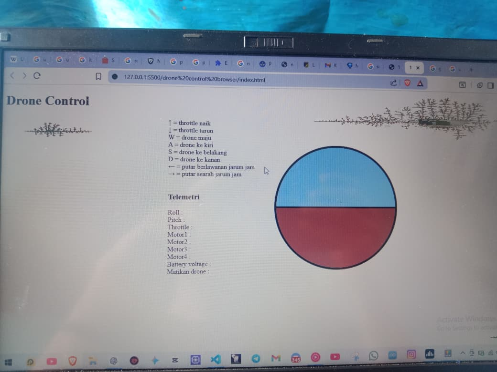

Custom Drone Flight Controller AND Frame DIY

## Notes

This project was developed by me, with assistance from AI tools for documentation and code structuring.
Core hardware design, assembly, firmware development, and flight testing were done by me.

## Flight Controller Features

- IMU sensor processing
- PID stabilization
- Motor mixing
- Wireless telemetry
- Real-time control

## Project Images

  
  
  

## System Architecture

  

## Hardware Specifications

### Controller
- ESP8266

### Sensor
- MPU6050

### Frame
- F450

### Motors
- Brushless Motors

### ESC
- 30A ESC

# Development Process

## 1. Hardware Selection

The drone was designed using readily available and cost-effective components while maintaining structural strength and flight stability.

### Selected Components

- Carbon fiber tubes for the frame arms
- Plywood center plates
- Brushless motors
- SimonK 30A ESCs
- MPU6050 IMU sensor
- ESP8266 microcontroller
- Jumper wires and power distribution wiring
- On/off power switch
- 2200µF 30V capacitor for power stabilization
- CNHL 3S 2200mAh LiPo battery
- 10x4.5 propellers

The objective was to create a lightweight F450-class quadcopter capable of stable flight and wireless telemetry communication.

---

## 2. Hardware Development

The frame was built from scratch using carbon fiber tubes and custom-cut plywood center plates.

### Frame Construction

- Cut four carbon fiber tubes to 23 cm each for the arms.
- Cut two plywood center plates measuring 10 cm × 10 cm.
- Assembled the frame using bolts and adhesive.
- Verified frame alignment and measured a final diagonal size of approximately 45 cm.

### Electronics Integration

- Installed motor mounts on each arm.
- Mounted the ESCs in the center section for improved cable management.
- Routed power and signal wiring between the ESP8266, ESCs, and motors.
- Added a 2200µF 30V capacitor to reduce voltage spikes and electrical noise.
- Installed a dedicated power switch.
- Mounted the CNHL 3S 2200mAh battery underneath the center plate.
- Installed the propellers after all calibration and safety checks were completed.

---

## 3. Firmware Development

Custom flight controller firmware was developed using C++ on the ESP8266 platform.

### Sensor Processing

- Implemented MPU6050 communication and sensor data acquisition.
- Processed gyroscope and accelerometer measurements for attitude estimation.
- Added sensor calibration routines.

### Flight Stabilization

- Developed a custom PID control algorithm for flight stabilization.
- Integrated sensor feedback into the control loop.
- Implemented motor mixing logic for quadcopter flight control.

### Telemetry and Configuration

- Developed a web-based telemetry and control interface.
- Implemented real-time communication using WebSocket technology.
- Added EEPROM storage for:
  - Gyroscope calibration values
  - Accelerometer calibration values
  - Persistent configuration parameters

---

## 4. Flight Testing and PID Tuning

Multiple testing stages were performed to ensure safe and stable operation.

### Pre-Flight Validation

- ESC calibration
- Gyroscope calibration
- Accelerometer calibration
- Firmware verification
- Motor direction verification
- Safety checks before propeller installation

### Initial PID Tuning

- Secured the drone using restraints.
- Determined initial PID values while minimizing flight risk.
- Verified control responsiveness and stability.

### Hover Testing

- Performed free-flight hover tests.
- Adjusted PID parameters to improve stability and responsiveness.
- Conducted separate tuning sessions for:
  - Indoor flight conditions
  - Outdoor flight conditions

### Final Results

- Stable hover achieved.
- Reliable PID stabilization implemented.
- Functional web-based telemetry system.
- Persistent calibration storage through EEPROM.
- Successful integration of hardware and firmware into a fully operational quadcopter flight controller.

## Future Improvements

- GPS integration
- Autonomous flight modes
- Enhanced telemetry dashboard
- Battery monitoring system

## Photo of the Manufacturing Process

  
  
  
  
  
  
  
  

