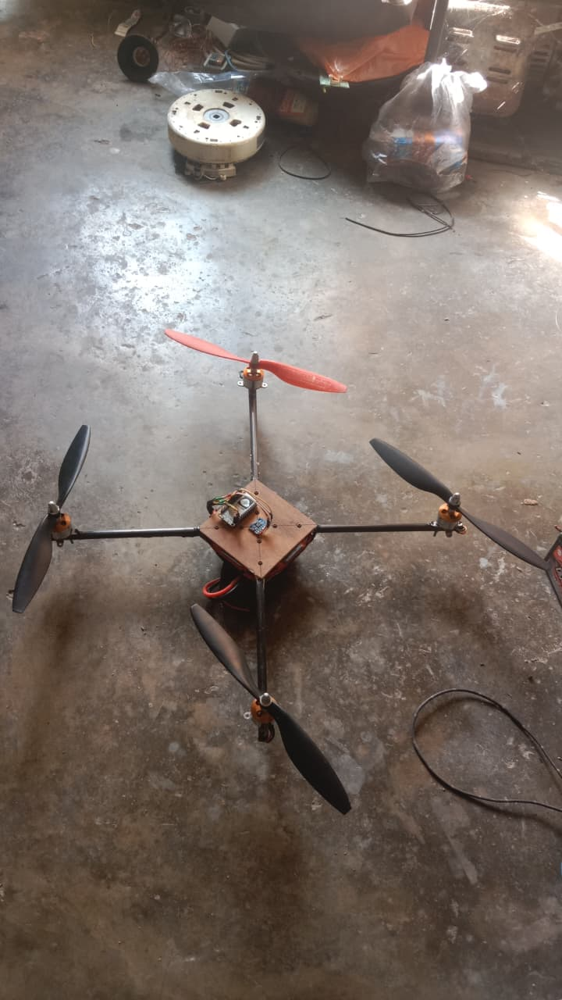
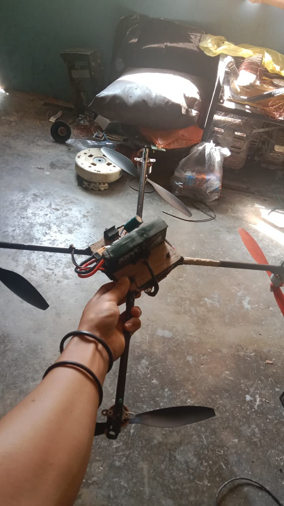

Custom Drone Flight Controller AND Frame DIY

## Flight Controller Features

- IMU sensor processing
- PID stabilization
- Motor mixing
- Wireless telemetry
- Real-time control

## Hardware

- ESP8266
- MPU6050
- F450 Frame
- Brushless Motors
- ESC

## Result
- Stable flight
- Wireless telemetry
- Real-time control

## Project Images

### Top View

### Bottom View

### Telemetry Screen

  
  

